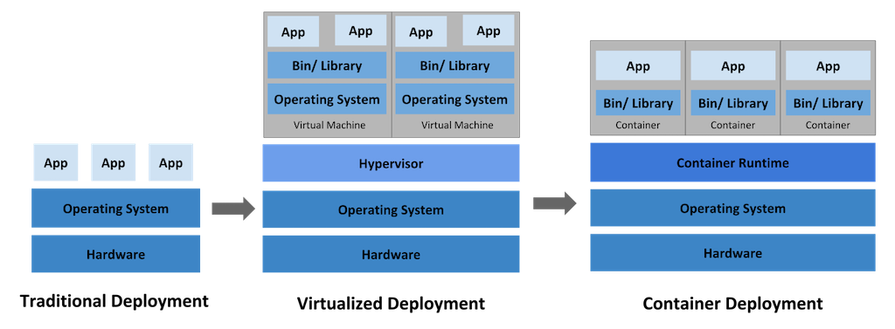
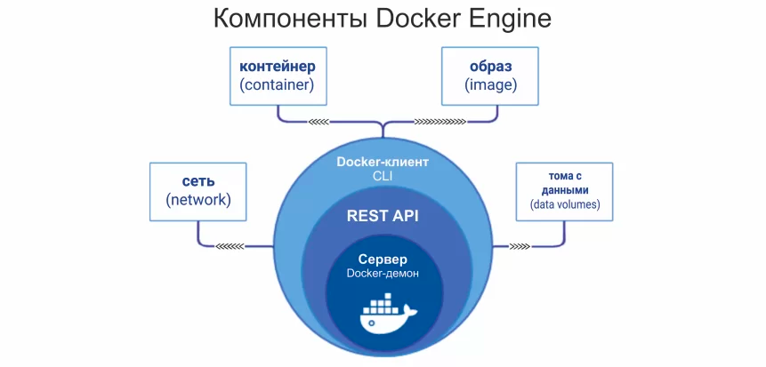
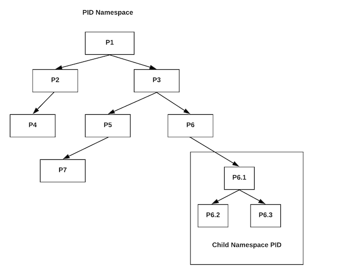
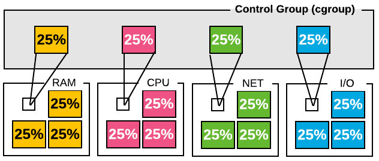
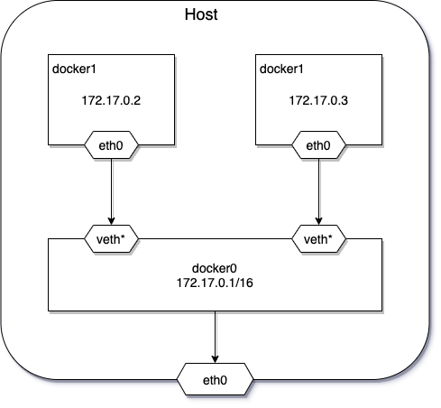

# Docker

Docker - это средство виртуализации, одно из назначений которого виртуализация рабочих сред на серверах. Также он
предоставляет универсальный способ доставки приложений на машины (локальный компьютер или удаленные сервера)
и их запуска в изолированном окружении.

Основные понятия:

* Образ (Image) — это read-only шаблон для создания Docker-контейнеров. Представляет собой исполняемый пакет, содержащий
  все необходимое для запуска приложения: код, среду выполнения, библиотеки, переменные окружения и файлы конфигурации.
  Docker-образ состоит из слоев. Каждое изменение записывается в новый слой.
* Контейнер (Container) — запущенный процесс операционной системы в изолированном окружении с подключенной файловой
  системой из образа.

Контейнер — всего лишь обычный процесс операционной системы. Разница лишь в том, что благодаря возможностям ядра, docker
стартует процесс в изолированном окружении. Контейнер видит свой собственный список процессов, свою собственную сеть,
свою собственную файловую систему и т.д. Пока ему не укажут явно, он не может взаимодействовать с вашей основной
операционной системой и всем, что в ней хранится или запущено.

## Предпосылки возниконовения контейнеризации



##### Традиционная эра развертывания

Раньше приложения запускали на физических серверах, поэтмоу не было никакого способа определить границы ресурсов для
приложений на физическом сервере, и это вызвало проблемы с распределением ресурсов. Например, если несколько приложений
выполняются на физическом сервере, могут быть случаи, когда одно приложение будет занимать большую часть ресурсов, и в
результате чего другие приложения будут работать хуже. Решением этого было запустить каждое приложение на другом
физическом сервере. Из-за этого прилоежния не использовали всю мощность серверов, где они запущены, но место в
датацентрах и сами сервера стоили дорого, а значит использование нескольких серверов получалось финансово невыгодно.

##### Эра виртуализации

В качестве решения была представлена виртуализация. Она позволила запускать несколько виртуальных машин (VM) на одном
физическом сервере. Виртуализация изолирует приложения между виртуальными машинами и обеспечивает определенный уровень
безопасности, поскольку информация одного приложения не может быть свободно доступна другому приложению.

Виртуализация позволяет лучше использовать ресурсы на физическом сервере и обеспечивает лучшую масштабируемость,
поскольку приложение можно легко добавить или обновить, кроме этого снижаются затраты на оборудование и многое другое. С
помощью виртуализации можно превратить набор физических ресурсов в кластер одноразовых виртуальных машин.

Каждая виртуальная машина представляет собой полноценную машину, на которой выполняются все компоненты, включая
собственную операционную систему, поверх виртуализированного оборудования.

##### Эра контейнеризации

Контейнеры похожи на виртуальные машины, но у них есть свойства изоляции для совместного использования операционной
системы (ОС) между приложениями, поэтому контейнеры считаются легкими. Подобно виртуальной машине, контейнер имеет свою
собственную файловую систему, процессор, память, пространство процесса и многое другое. Поскольку они не связаны с
базовой инфраструктурой, они переносимы между облаками и дистрибутивами ОС.


## Архитектура Docker

Docker использует архитектуру клиент-сервер. Docker клиент общается с docker daemon, который берет на себя задачи
создания, запуска, распределения контейнеров. Клиент и сервер общаются через сокет (по-умолчанию) или через REST API.



Docker Engine — ядро механизма Докера, он отвечает за функционирование и обеспечение связи между основными
docker-объектами (реестром, образами и контейнерами).

* `Docker Daemon` выполняет инициализацию демона (фоновой программы), который применяется для управления и модификации
  контейнеров, образов и volumes.
* `REST API` — механизм, отвечающий за организацию взаимодействия Docker Client и Docker Daemon.
* `CLI` — позволяет пользователю взаимодействовать с сервером при помощи команд, набираемых в терминале.

Для работы docker использует следующие механизмы операционной системы:

##### namespaces

Namespaces – это механизм ядра Linux, обеспечивающий изоляцию процессов друг от друга. Включает в себя:

* network – предоставляет контейнеру свое представление сетевого стека (interfaces, routing tables, network devices, и
  т.д.);
* mounts – точки монтирования;
* UTS – Unix Timeshare System, позволяет процессам иметь свои системные идентификаторы hostname и NIS domain name,
  отличные от других контейнеров и host-машины;
* user – изоляция пользоватей внутри контейнера;
* IPC – InterProcess Communication, ответственна за изоляцию ресурсов между процессами внутри контейнера.



##### cgroups

Docker использует технологию ядра Linux cgroups, которая изолирует, приоритизрует и выдает квоты на использование
ресурсов системы для группы процессов. С помощью этой технологии контейнеры docker получают только те ресурсы, которые
были ему выделены.



### CRI-O, containerd, runc


* `Container Runtime Interface` (`CRI`) определяет API между Kubernetes и Container Runtime (средой выполнения контейнеров).
* `containerd` – Linux Daemon, который управляет контейнерами и запускает их. Он загружает образы из репозитория,
  управляет хранилищем и сетью, а также контролирует работу контейнеров.
* `runc` – низкоуровневая среда выполнения контейнеров, которая создает и запускает контейнеры.

### Структура образа

Образ состоит из слоев, каждый из которых представляет собой неизменяемую файловую систему, а по-простому набор файлов и
директорий. Образ в целом представляет собой объединенную файловую систему (Union File System), которую можно
рассматривать как результат слияния файловых систем слоев. Объединенная файловая система умеет обрабатывать конфликты,
например, когда в разных слоях присутствуют файлы и директории с одинаковыми именами. Каждый следующий слой добавляет
или удаляет какие-то файлы из предыдущих слоев. В данном контексте "удаляет" можно рассматривать как "затирает", т.е.
файл в нижележащем слое остается, но его не будет видно в объединенной файловой системе.

Образ использует AuFS (advanced multi-layered unification filesystem - вспомогательная файловая система, образующая
каскадно-объединённое монтирование для файловых систем Linux) для прозрачного монтирования файловых систем.


В папке `/var/lib/docker/overlay2` слови представлены папками, в папке l хранятся коротки ссылки на имена для
использования в команде mount. В каждом образе хранится (кроме базового, там только link и diff):

* link – файл, который содержит короткое имя директории из папки l;
* lower – файл, который ссылается на короткое имя родителя;
* diff – директория, которая содержит данные самого образа;
* merged – актуальный контент этого образа (слитый с родительским diff);
* work – для внутреннего использования в OverlayFS.

Для просмотра слоев контейнера удобно использовать утилиту [dive](https://github.com/wagoodman/dive).

## Основные команды docker

```shell
# запустить контейнер postgres:13 на порту 5432, данные сохранять в локальный volume с именем postgres-data
# и создать пользователя test:test и базу example
$ docker run \
    --name postgres \
    -p 5432:5432 \
    -e POSTGRES_USER=test \
    -e POSTGRES_PASSWORD=test \
    -e POSTGRES_DB=services \
    -v postgres-data:/var/lib/postgresql/data \
    postgres:13

# сборка образа frontend в папке example/frontend
$ docker build examples/frontend -t my-frontend:v1.0

# вывод всех образов
$ docker images

# вывод всех volumes
$ docker volume ls

# просмотр информации о конкретном volume
$ docker volume inspect postgres-data

# вывод логов контейнера
$ docker logs postgres 

# просмотр запущенных контейнеров
$ docker ps

# просмотр всех контейнеров
$ docker ps -a

# просмотр всех сведение о контейнере
$ docker inspect postgres 

# получение внутреннего ip-адреса контейнера
$ docker inspect --format='{{range .NetworkSettings.Networks}}{{.IPAddress}}{{end}}' postgres 

# получение пути к папке с логами контейнера
$ docker inspect --format='{{.LogPath}}' postgres 

# получение информации об используемом образе
$ docker inspect --format='{{.Config.Image}}' postgres 

# заход внутрь образа
$ docker exec --interactive --tty postgres /bin/bash 

# остановка, старт и рестарт контейнера
$ docker stop postgres 
$ docker start postgres 
$ docker restart postgres 

# информация о потребляемых ресурсах docker
$ docker stats

# удаление контейнера postgres
$ docker rm postgres 

# удаление образа postgres:13
$ docker rmi postgres:13

# показать запущенные процессы в контейнере
$ docker top postgres
```

## Dockerfile

```dockerfile
# Указывает с какого образаа брать сборку.
FROM ubuntu:20.04
# Указывает от какого пользоватя (и опционально группы) запускаются дальнейшие команды.
USER ronin:staff
# Информирует что образ слушает порт 8080 по протоколу tcp.
EXPOSE 8080/tcp
# Указывает из какой директории выполнять дальнейшие инструкции.
# Если указан относительный путь, он будет применяться относительно предыдущих инструкций WORKDIR.
WORKDIR application
# Определяет перменную, оторую пользователь может передать при запуске `docker build --build-arg <varname>=<value>`.
ARG PROFILE=docker
# Копирует файлы с host-машины в образ, доступны wildcards, --chmod user:user.
# ADD умеет распаковывать архивы, но в документации советуют использовать COPY, где магия ADD не требуется.
ADD https://github.com/Netflix/eureka/archive/refs/tags/v1.10.17.zip /app/eureka
COPY build/libs/order-service.jar /app/order-service.jar
# Задает переменные окружения. Переменная окружения будет определена для запущенного контейнера
ENV SPRING_PROFILES_ACTIVE=$PROFILE
# выполняет каждую команду в новом слое поверх текущего слоя.
RUN apt-get update && \
  apt-get install openjdk-11-jdk -y
# Задает дефолтную команду при старте. Одна команда на контейнер и может быть перезаписана при старте контейнера.
CMD ["bash", "-c", "echo $HOME"]
# Позволяет описывать контейнер как исполняемый.
# The ENTRYPOINT specifies a command that will always be executed when the container starts.
# The CMD specifies arguments that will be fed to the ENTRYPOINT
ENTRYPOINT ["java", "org.springframework.boot.loader.JarLauncher"]
```

Пример использования CMD и ENTRYPOINT:

```dockerfile
FROM ubuntu:20.04
ENTRYPOINT ["/bin/ping"]
CMD ["localhost"]
```

Запуск контейнера выдает следующее:

```shell
$ cd examples
$ docker build . -t ping
$ docker run ping
PING localhost (127.0.0.1) 56(84) bytes of data.
64 bytes from localhost (127.0.0.1): icmp_seq=1 ttl=64 time=0.033 ms
64 bytes from localhost (127.0.0.1): icmp_seq=2 ttl=64 time=0.094 ms
64 bytes from localhost (127.0.0.1): icmp_seq=3 ttl=64 time=0.270 ms

--- localhost ping statistics ---
3 packets transmitted, 3 received, 0% packet loss, time 2046ms
rtt min/avg/max/mdev = 0.033/0.132/0.270/0.100 ms

$ docker run ping ya.ru
PING ya.ru (87.250.250.242) 56(84) bytes of data.
64 bytes from ya.ru (87.250.250.242): icmp_seq=1 ttl=37 time=12.1 ms
64 bytes from ya.ru (87.250.250.242): icmp_seq=2 ttl=37 time=11.5 ms

--- ya.ru ping statistics ---
2 packets transmitted, 2 received, 0% packet loss, time 1002ms
rtt min/avg/max/mdev = 11.478/11.802/12.126/0.324 ms
```

### Оптимизация размера образа

Образ — это не что иное, как коллекция других образов, можно прийти к очевидному выводу: размер образа равен сумме
размеров образов, его составляющих.

```shell
$ docker history store-service:v1.0
IMAGE          CREATED       CREATED BY                                      SIZE      COMMENT
c1a96c337def   5 days ago    ENTRYPOINT ["java" "-Dserver.port=${PORT:-84…   0B        buildkit.dockerfile.v0
<missing>      5 days ago    COPY application/application/ ./ # buildkit     179kB     buildkit.dockerfile.v0
<missing>      5 days ago    COPY application/snapshot-dependencies/ ./ #…   0B        buildkit.dockerfile.v0
<missing>      5 days ago    COPY application/dependencies/ ./ # buildkit    126MB     buildkit.dockerfile.v0
<missing>      5 days ago    COPY application/spring-boot-loader/ ./ # bu…   252kB     buildkit.dockerfile.v0
<missing>      5 days ago    WORKDIR /application                            0B        buildkit.dockerfile.v0
<missing>      5 days ago    ENV PORT=8480                                   0B        buildkit.dockerfile.v0
<missing>      2 weeks ago   /bin/sh -c #(nop)  CMD ["jshell"]               0B        
<missing>      2 weeks ago   /bin/sh -c set -eux;   arch="$(dpkg --print-…   343MB     
<missing>      2 weeks ago   /bin/sh -c #(nop)  ENV JAVA_VERSION=11.0.13     0B        
<missing>      2 weeks ago   /bin/sh -c #(nop)  ENV LANG=C.UTF-8             0B        
<missing>      2 weeks ago   /bin/sh -c #(nop)  ENV PATH=/usr/local/openj…   0B        
<missing>      2 weeks ago   /bin/sh -c { echo '#/bin/sh'; echo 'echo "$J…   27B       
<missing>      2 weeks ago   /bin/sh -c #(nop)  ENV JAVA_HOME=/usr/local/…   0B        
<missing>      2 weeks ago   /bin/sh -c set -eux;  apt-get update;  apt-g…   11.3MB    
<missing>      2 weeks ago   /bin/sh -c apt-get update && apt-get install…   152MB     
<missing>      2 weeks ago   /bin/sh -c set -ex;  if ! command -v gpg > /…   18.9MB    
<missing>      2 weeks ago   /bin/sh -c set -eux;  apt-get update;  apt-g…   10.7MB    
<missing>      2 weeks ago   /bin/sh -c #(nop)  CMD ["bash"]                 0B        
<missing>      2 weeks ago   /bin/sh -c #(nop) ADD file:5259fc086e8295ddb…   124MB  
```

Каждая дополнительная инструкция в Dockerfile будет только увеличивать общий размер образа. Соответственно, чтобы
уменьшить результирующий размер образа:

* нужно объединять однотипные команды;
* использовать максимально компактный базовый образ, например на базе [Alpine Linux](https://hub.docker.com/_/alpine);
* использовать multistage build, чтобы не тащить в результирующий образ лишнее.

### Volumes

Для хранения данных между перезапусками контейнеров используется абстракция, называемая volume.

Для подключения конфигурационных файлов или добавления информации внутрь контейнера можно примонтировать папку с
host-машины: `--volume $(pwd)/postgres:/docker-entrypoint-initdb.d/`.

Для персистентного хранения данных лучше создать Volume и примонтировать его при запуке
контейнера `--volume data_volume:/var/lib/postgresql/data`.

```shell
$ docker volume create data_volume

$ docker volume ls
DRIVER    VOLUME NAME
local     micro-services-v2_db-data
local     micro-services-v2_grafana-data
local     micro-services-v2_prometheus-data
local     data_volume

$ docker volume inspect data_volume
[
    {
        "CreatedAt": "2021-12-01T12:59:47Z",
        "Driver": "local",
        "Labels": {},
        "Mountpoint": "/var/lib/docker/volumes/data_volume/_data",
        "Name": "data_volume",
        "Options": {},
        "Scope": "local"
    }
]

$ docker run \
    -e POSTGRES_USER=program \
    -e POSTGRES_PASSWORD=test \
    -e POSTGRES_DB=services \
    --volume data_volume:/var/lib/postgresql/data \
    postgres:13

$ docker volume rm data_volume
```

### Network

#### Сетевое взаимодействие

При запуске docker-процесса, он создает новый виртуального интерфейс типа bridge с названием docker0 в host-системе.
Этот интерфейс позволяет docker создать виртуальную подсеть для использования контейнерами, которые он будет запускать.
Мост будет служить основной точкой взаимодействия между сетью внутри контейнера и сетью хоста.

Когда docker запускает контейнер, создается новый виртуальный интерфейс и ему назначается адрес в диапазоне подсети
моста. IP-адрес связан с внутренней сетью контейнера, предоставляя путь для сети контейнера к мосту docker0 на системе
хоста. Docker автоматически конфигурирует правила в iptables для обеспечения переадресации и конфигурирует NAT для
трафика из docker0 во внешнюю сеть.



#### Port exposing and publishing

* Открытие порта (`EXPOSE`) информирует docker, что данный порт используется контейнером. Эта информация, например,
  доступна в `docker inspect <container-name>`.
* Публикация порта (`-p 8080:8080`) маппирует порт на интерфейс хоста, делая его доступным для внешенго мира.

#### Взаимодействие между контейнерами

Для взаимодействия между контейнерами нужно создать между ними сеть. Есть несколько основных видов сетей:

* `bridge` – сеть типа мост для взаимодействия между контейнерами.
    * По-умолчанию, docker создает дефолтную bridge сеть между всеми контейнерами, но она не предоставляет резолв DNS,
      соответственно, общение между контейнерами требуется выполнять с помощью ip-адресов (--link flag deprecated).
    * Если создается user-defined сеть, то внутри можно обращаться по имени контейнера.
* `host` – монтируется на сеть host-машины, порты внутри контейнера аллоцируются сразу на host машине. Работает только
  на Linux и не поддерживается Docker for Desktop for Mac, Docker Desktop for Windows, Docker EE for Windows Server.
* `macvlan` – docker host принимает запросы на несколько MAC-адресов по своему ip-адресу и направляют эти запросы в
  соответствующий контнейр.
* `overlay` – создает покрывающую сеть между несколькими машинами с docker. Используется в Kubernetes.

Дефолтная bridge сеть имеет ряд существенных недостатков, поэтому для взаимодействия контейнеров стоит всегда создавать
отдельные сети, включающие только необходимые контейнеры.

* Связанные контейнеры (при использовании `--link flag`) в дефолтной сети имеют общие переменные среды.
* Контейнеры могут подключаться и отключаться от сети на лету.
* User-defined сеть служит для лучшей изоляции, например, чтобы только определенные контейнеры имели доступ до postgres.

```shell
$ docker network create --driver bridge postgres-network

$ docker network ls
NETWORK ID     NAME      DRIVER    SCOPE
58a6e614b3a8   bridge                bridge    local
590e8b94c17e   host                  host      local
023f4b24772f   none                  null      local
340fa41db593   postgres-network      bridge    local

$ docker run \
      --name postgres \
      -e POSTGRES_USER=program \
      -e POSTGRES_PASSWORD=test \
      -e POSTGRES_DB=services \
      --network postgres-network \
      postgres:13

$ docker run \
      -p 8480:8480 \
      --name store-service \
      --network postgres-network \
      -e SPRING_PROFILES_ACTIVE=docker \
      romanowalex/store-service:v1.0

$ docker inspect -f "{{json .NetworkSettings.Networks }}" store-service | jq
{
  "bridge": {
    ...
    "Gateway": "172.17.0.1",
    "IPAddress": "172.17.0.2",
    ...
  },
  "postgres-network": {
    ...
    "Aliases": [
      "39259c05ed2c"
    ],
    ...
    "Gateway": "192.168.32.1",
    "IPAddress": "192.168.32.3",
    "MacAddress": "02:42:c0:a8:20:03",
    ...
  }
}
```

## Литература

1. [Что такое Docker и как его использовать в разработке](https://eternalhost.net/blog/razrabotka/chto-takoe-docker)
2. [Различия между Docker, containerd, CRI-O и runc](https://habr.com/ru/company/domclick/blog/566224/)
3. [Best practices for writing Dockerfiles](https://docs.docker.com/develop/develop-images/dockerfile_best-practices/)
4. [20 лучших практик по работе с Dockerfile](https://habr.com/ru/company/domclick/blog/546922/)
7. [Docker Bridge Networking Deep Dive](https://medium.com/@xiaopeng163/docker-bridge-networking-deep-dive-3e2e0549e8a0)