# Сети

## Типы сетевых устройств

* **Hub** – многопортовый повторитель, он рассылает входящий сигнал по всем остальным портам.
  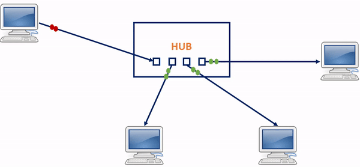
* **Switch (Коммутатор)** – хранит в памяти таблицу коммутации, в которой указывается соответствие MAC-адреса узла порту
  коммутатора. При включении коммутатора эта таблица пуста, и он работает в режиме обучения. В этом режиме поступающие
  на какой-либо порт данные передаются на все остальные порты коммутатора. При этом коммутатор анализирует фреймы (
  кадры) и, определив MAC-адрес хоста-отправителя, заносит его в таблицу на некоторое время. Впоследствии, если на один
  из портов коммутатора поступит кадр, предназначенный для хоста, MAC-адрес которого уже есть в таблице, то этот кадр
  будет передан только через порт, указанный в таблице. Если MAC-адрес хоста-получателя не ассоциирован с каким-либо
  портом коммутатора, то кадр будет отправлен на все порты, за исключением того порта, с которого он был получен. Со
  временем коммутатор строит таблицу для всех активных MAC-адресов, в результате трафик локализуется.
  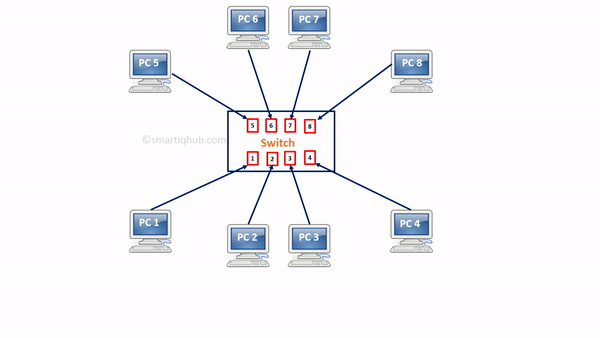
* **Router (Маршрутизатор)** — это устройство, предназначенное для пересылки пакетов из одной канальной среды в другую.
  Работает на Сетевом уровне модели OSI. Маршрутизатор использует адрес получателя, указанный в заголовке пакета, и
  определяет по таблице маршрутизации путь, по которому следует передать данные. Если в таблице маршрутизации для адреса
  нет описанного маршрута — пакет отбрасывается. Таблица маршрутизации содержит информацию, на основе которой
  маршрутизатор принимает решение о дальнейшей пересылке пакетов. Таблица состоит из некоторого числа записей —
  маршрутов, в каждой из которых содержится идентификатор сети получателя (состоящий из адреса и маски сети), адрес
  следующего узла, которому следует передавать пакеты.
  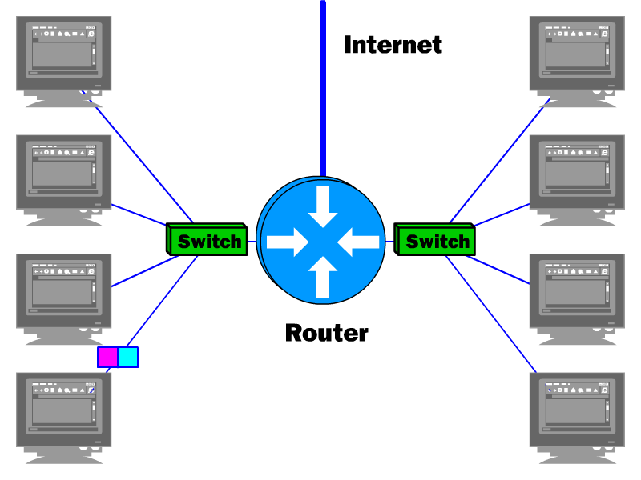

## Модель OSI

Для единого представления данных в сетях с неоднородными устройствами и программным обеспечением международная
организация по стандартам ISO (International Standardization Organization) разработала базовую модель связи открытых
систем OSI (Open System Interconnection). Эта модель описывает правила и процедуры передачи данных в различных сетевых
средах при организации сеанса связи. Основными элементами модели являются уровни, прикладные процессы и физические
средства соединения.

Каждый уровень модели OSI выполняет определенную задачу в процессе передачи данных по сети. Базовая модель является
основой для разработки сетевых протоколов. OSI разделяет коммуникационные функции в сети на семь уровней, каждый из
которых обслуживает различные части процесса области взаимодействия открытых систем. Модель OSI описывает только
системные средства взаимодействия, не касаясь приложений конечных пользователей. Приложения реализуют свои собственные
протоколы взаимодействия, обращаясь к системным средствам.

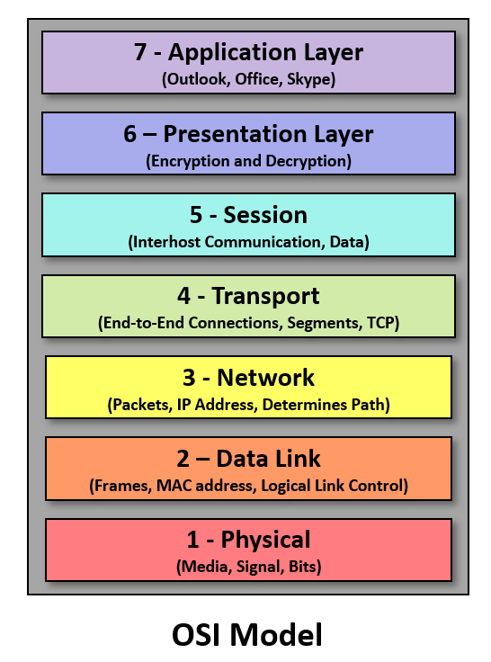

Сетевая модель OSI состоит из 7 уровней, причем принято начинать отсчёт с нижнего:

* **Прикладной уровень (Application Layer)** - осуществляет связь пользовательских приложений с сетью. На этом уровне
  работают протоколы HTTP, FTP, SMTP, Telnet.
* **Уровень представления (Presentation Layer)** - преобразует данные в соответствующий формат. Фактически - это уровень
  работы с протоколами (стандартами) изображений (JPEG, GIF, PNG, TIFF), кодировок (ASCII, EBDIC), музыки и видео (MPEG)
  и т.д.
* **Сеансовый уровень (Session Layer)** - это уровень, определяющий процедуру проведения сеансов между пользователями
  или прикладными процессами. Этот уровень управляет передачей информации между прикладными процессами, координирует
  прием, передачу и выдачу одного сеанса связи.
* **Транспортный уровень (Transport Layer)** - этот уровень предназначен для передачи пакетов через коммуникационную
  сеть, на нем пакеты разбиваются на блоки. Транспортный уровень определяет адресацию физических устройств (систем, их
  частей) в сети. Этот уровень гарантирует доставку блоков информации адресатам и управляет этой доставкой. Его главной
  задачей является обеспечение эффективных, удобных и надежных форм передачи информации между системами. Когда в
  процессе обработки находится более одного пакета, транспортный уровень контролирует очередность прохождения пакетов.
  Если проходит дубликат принятого ранее сообщения, то данный уровень опознает это и игнорирует сообщение. На этом
  уровне работают протоколы TCP (Transmission Control Protocol), UDP (User Datagram Protocol), NCP (Network Control
  Protocol).
* **Сетевой уровень (Network Layer)** - этот уровень обеспечивает прокладку каналов, соединяющих абонентские и
  административные системы через коммуникационную сеть, выбор маршрута наиболее быстрого и надежного пути. Сетевой
  уровень устанавливает связь в вычислительной сети между двумя системами и обеспечивает прокладку виртуальных каналов
  между ними. Сообщения сетевого уровня принято называть пакетами (packet), в них помещаются фрагменты данных. Сетевой
  уровень отвечает за их адресацию и доставку. На этом уровне работают протоколы IP (IPv4, IPv6), ICMP (Internet Control
  Message Protocol - ping).
* **Канальный уровень (Data Link Layer)** обеспечивает корректность передачи каждого кадра, помещая специальную
  последовательность бит, в начало и конец каждого кадра, чтобы отметить его, а также вычисляет контрольную сумму,
  суммируя все байты кадра определенным способом и добавляя контрольную сумму к кадру. Когда кадр приходит, получатель
  снова вычисляет контрольную сумму полученных данных и сравнивает результат с контрольной суммой из кадра. Если они
  совпадают, кадр считается правильным и принимается. Если же контрольные суммы не совпадают, то фиксируется ошибка.
  Задача канального уровня – брать пакеты, поступающие с сетевого уровня и готовить их к передаче, укладывая в кадр
  соответствующего размера. Этот уровень обязан определить, где начинается и где заканчивается блок, а также
  обнаруживать ошибки передачи. На этом уровне работают протоколы Ethernet, FDDI (Fiber Distributed Data Interface),
  IEEE 802.11, Wi-Fi, PPP (Point-to-Point Protocol), PPPoE (Point-to-Point Protocol over Ethernet).
* **Физический уровень (Physical Layer)** - этот уровень описывает способы передачи бит (а не пакетов данных) через
  физические среды линий связи, соединяющие сетевые устройства. На этом уровне описываются параметры сигналов, такие как
  амплитуда и частота, используемая модуляция и другие низкоуровневые параметры.

### Канальный уровень

Он включает в себя Физический и Канальный уровни модели OSI.

Задача физического уровня – представить биты в виде сигналов, передаваемых по среде.

Задача канального уровня – передача сообщений по каналам связи – кадров, т.е. определение где в сообщении начало, где
конец. На канальном уровне работает Ethernet и Wi-Fi. Этот уровень делится на два подуровня:

* Подуровень управления доступом к серее (MAC): на этом подуровне находится MAC-адрес – идентификатор компьютера в
  канальной среде. С помощью MAC-адресов выполняется передача данных на канале, это идентификатор компьютера в среде.
* Подуровень управления логической связью: на этом подуровне производится обнаружение и исправление ошибок переданных
  данных.

### Сетевой уровень

На этом уровне выполняется объединение различных подсетей, построенных по различным технологиям, выполняется
согласование:

* Кадры из Wi-Fi принимаются с отправкой подтверждения, а Ethernet без;
* Глобальные адреса, не зависящие от конкретных технологий (в Ethernet / Wi-Fi MAC-адреса, в GSM IMEI);
* Методы преобразования локального адреса в глобальный (ARP протокол);
* Согласование размера кадра (если размер различный, то кадры фрагментируются, а потом снова склеиваются).

Построить сеть по протоколу Ethernet нельзя потому что:

* таблица коммутации будет просто огромной;
* ARP-запросы заполонят весь интернет.

## Выполнение запроса с локального компьютера до google.com

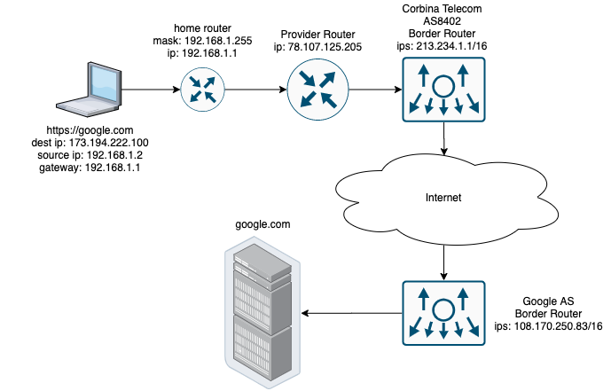

В нашей домашней сети есть роутер, наш компьютер получил ip адрес по протоколу DHCP, соответственно он знает:

* свой ip адрес `192.168.1.2`;
* маску подсети `192.168.1.1/32`;
* default gateway `192,168.1.1` – адрес домашнего роутера.

Предположим, нам нужно сделать запрос с домашнего компьютера на google.com. Рассмотрим процесс выполнения запроса по
слоям с акцентом на используемые протоколы. Мы вводим в строке браузера адрес `https://google.com`, с помощью протокола
DNS мы получаем ip адрес `216.58.210.142`.

```
traceroute to google.com (216.58.210.174), 64 hops max, 52 byte packets
 1  xiaoqiang (192.168.31.1)  4.502 ms  9.079 ms  1.900 ms
 2  78.107.125.205 (78.107.125.205)  3.835 ms  2.178 ms  4.901 ms
 3  plehan9-bng3-local.msk.corbina.net (78.107.1.214)  3.885 ms  2.144 ms  1.800 ms
 4  10.2.254.82 (10.2.254.82)  3.124 ms  2.295 ms  2.054 ms
 5  195.14.54.139 (195.14.54.139)  7.812 ms  2.855 ms  2.507 ms
 6  213.234.224.131 (213.234.224.131)  4.899 ms
    213.234.224.150 (213.234.224.150)  5.607 ms
    213.234.224.174 (213.234.224.174)  11.520 ms
 7  213.234.224.158 (213.234.224.158)  4.673 ms
    85.21.224.191 (85.21.224.191)  6.868 ms
    ko-bb-vlan-302.corbina.net (85.21.93.129)  5.808 ms
 8  72.14.198.182 (72.14.198.182)  6.505 ms
    google-gw.msk.corbina.net (195.14.32.22)  5.273 ms  12.840 ms
 9  * * *
10  209.85.255.100 (209.85.255.100)  31.796 ms  22.843 ms
    108.170.227.78 (108.170.227.78)  7.784 ms
11  142.250.37.65 (142.250.37.65)  24.867 ms
    108.170.250.130 (108.170.250.130)  5.790 ms
    142.250.37.81 (142.250.37.81)  21.901 ms
12  216.239.40.88 (216.239.40.88)  30.991 ms
    142.251.49.158 (142.251.49.158)  18.505 ms *
13  hem08s07-in-f14.1e100.net (216.58.210.174)  34.062 ms
    209.85.255.100 (209.85.255.100)  51.187 ms
    142.250.37.65 (142.250.37.65)  19.042 ms
```

Т.к. маршрутизация запросов в локальной сети выполняется с помощью MAC адресов (на канальном уровне), нам надо узнать
какой MAC адрес у gateway `192.168.1.1`. Для этого используется протокол ARP.

### ARP (Address Resolution Protocol)

ARP (протокол определения адреса) – протокол в компьютерных сетях, предназначенный для определения MAC-адреса по
IP-адресу другого компьютера. Работает на канальном уровне. Алгоритм работы:

1. Узел, которому нужно выполнить отображение IP-адреса на локальный адрес, формирует ARP-запрос, вкладывает его в кадр
   протокола канального уровня, указывая в нем известный IP-адрес, и рассылает запрос широковещательно (`ff:ff:ff:ff:ff:
   ff`).
1. Все узлы локальной сети получают ARP-запрос и сравнивают указанный там IP-адрес с собственным.
1. В случае их совпадения узел формирует ARP-ответ, в котором указывает свой IP-адрес и свой локальный адрес и
   отправляет его уже направленно, так как в ARP-запросе отправитель указывает свой локальный адрес.

Из-за того, что ARP находится ниже сетевого уровня, ARP запросы не могут пройти через маршрутизатор, т.е. с помощью
этого протокола можно узнать только IP-адреса компьютеров, находящихся в одной подсети.

Если запрашиваемый ip адрес находится вне текущей сети, то запрос направляется на шлюз (
быть может так же запрашивая его MAC-адрес по протоколу ARP). При запросе ip-адреса вне текущей сети ставится MAC-адрес
маршрутизатора, но ip адрес получателя остается.


Протокол ARP может использоваться для обнаружения конфликтов IP-адресов в локальной сети. RFC 5227 определяет формат
запроса 'ARP Probe' с полем SPA, состоящим из всех нулей (ip-адрес `0.0.0.0`)
. `0.0.0.0` используется, чтобы системы не сбрасывали свои ARP-кэши. Перед использованием IP-адреса хост может
проверить, что данный IP-адрес не используется другим хостом сегмента локальной сети.

### STP (Spanning Tree Protocol)

Для обеспечения отказоустойчивости из одной сети до другой можно добраться разными путями, т.е. в сети появляются петли.
Петля коммутации — состояние в сети, при котором происходит бесконечная пересылка фреймов между коммутаторами,
подключенными в один и тот же сегмент сети. Необходимость устранения топологических петель в сети Ethernet следует из
того, что их наличие в реальной сети Ethernet с коммутатором с высокой вероятностью приводит к бесконечным повторам
передачи одних и тех же кадров Ethernet одним и более коммутатором, отчего пропускная способность сети оказывается почти
полностью занятой этими бесполезными повторами. В этих условиях, хотя формально сеть может продолжать работать, на
практике её производительность становится настолько низкой, что может выглядеть как полный отказ сети.

STP (протокол покрывающего дерева) — канальный протокол. Основной задачей STP является устранение петель в топологии
произвольной сети Ethernet, в которой есть один или более сетевых мостов, связанных избыточными соединениями. STP решает
эту задачу, автоматически блокируя соединения, которые в данный момент для полной связности коммутаторов являются
избыточными. Алгоритм остовного дерева является основой протокола, динамически отключающего избыточные связи в сети
стандарта Ethernet (для образования древовидной топологии).

Суть работы протокола заключается в том, что поддерживающие его коммутаторы сети Ethernet обмениваются друг с другом
информацией о себе. На основании определённых условий (обычно в соответствии с настройками) один из коммутаторов
выбирается корневым (root), после чего все остальные коммутаторы по алгоритму остовного дерева выбирают для работы
порты, "ближайшие" к корневому коммутатору (учитывается количество посредников и скорость линий). Все прочие сетевые
порты, ведущие к корневому коммутатору, блокируются. Таким образом образуется несвязное дерево с корнем в выбранном
коммутаторе.

Алгоритм работы:

1. После включения коммутаторов в сеть по умолчанию каждый коммутатор считает себя корневым (root).
1. Каждый коммутатор начинает посылать по всем портам конфигурационные `Hello BPDU` пакеты раз в 2 секунды.
1. Если мост получает `BPDU` с идентификатором моста (`Bridge ID`) меньшим, чем свой собственный, он прекращает
   генерировать свои `BPDU` и начинает ретранслировать `BPDU` с этим идентификатором. Таким образом, в конце концов в
   этой сети Ethernet остаётся только один мост, который продолжает генерировать и передавать собственные `BPDU`. Он и
   становится корневым мостом (root bridge).
1. Просле выбора корневого коммутатора, остальные мосты ретранслируют `BPDU` корневого моста, добавляя в них информацию
   о стоимости доступа до корневого коммутатора (path cost).

   | Скорость соединения | Path cost |
                                 |---------------------|-----------|
   | 100 Mb/s            | 19        |
   | 1 Gb/s              | 4         |
   | 2 Gb/s              | 3         |
   | 10 Gb/s             | 2         |
1. Для каждого сегмента сети, к которому присоединено два и более портов мостов, происходит определение designated port
   — порта, через который, приходящие от корневого моста, попадают в этот сегмент кратчайшим маршрутом.
1. После этого все порты в сегментах, к которым присоединено 2 и более портов моста, блокируются за исключением root
   port и designated port.
1. Корневой мост продолжает посылать свои `Hello BPDU` раз в 2 секунды.

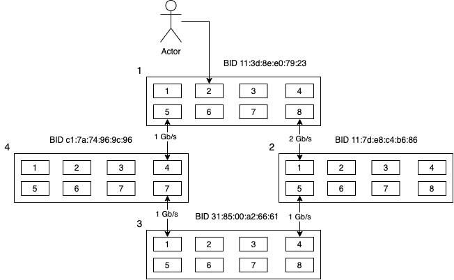

Каждый порт, задействованный в STP, может работать в одном из следующих режимов:

1. Root Port (корневой) — порт для передачи трафика корневому коммутатору. Каждый некорневой коммутатор имеет только
   один корневой порт, выбранный из соображений минимальной стоимости пути.
1. Designated Port (назначенный) — некорневой порт моста между сегментами сети, принимающий трафик из соответствующего
   сегмента. Сам мост также называется назначенным. В каждом сегменте сети может быть только один назначенный порт. У
   корневого коммутатора все порты — назначенные.
1. Non-designated Port (не назначенный) — порт, не являющийся корневым, или назначенным. Передача фреймов данных через
   такой порт запрещена.
1. Disabled Port (отключённый) — порт, не участвующий в STP, либо выключенный административно (командой shutdown).

### Изучение сети

После первого шага наш запрос вышел за границы домашней сети и теперь нам надо выполнить запрос к `216.58.210.142`, т.е.
построить маршрут от нашего маршрутизатора до маршрутизатора, обслуживающего сеть google.

Определение пути делится на два этапа: изучение сети и продвижение пакета.

При построении таблицы маршрутов:

* работаем с блоками адресов (подсетями);
* пакет отбрасывается, если нельзя определить куда его нужно отправить;
* в сети может быть нескольких путей.

#### RIP (routing information protocol)

RIP (протокол маршрутной информации) — так называемый протокол дистанционно-векторной маршрутизации, который оперирует
транзитными участками (hop) в качестве метрики маршрутизации. Максимальное количество транзитных участков, разрешенное в
RIP — 15 (метрика 16 означает "бесконечно большую метрику"). Каждый RIP-маршрутизатор по умолчанию вещает в сеть свою
полную таблицу маршрутизации раз в 30 секунд, довольно сильно нагружая низкоскоростные линии связи. RIP работает в сетях
TCP/IP, используя UDP порт 520.

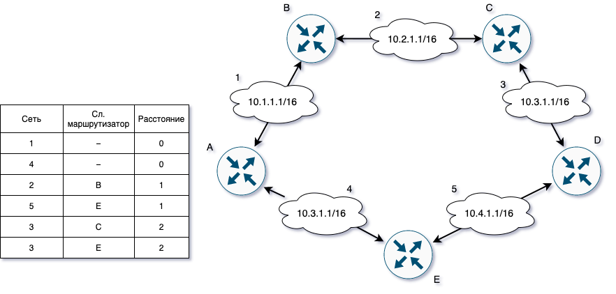

Алгоритм:

1. В этом протоколе все сети имеют номера (способ образования номера зависит от используемого в сети протокола сетевого
   уровня), а все маршрутизаторы - идентификаторы.
1. В начальный момент времени маршрутизатор имеет информацию только о подключенных к нему маршрутизаторах сети.
1. Маршрутизатор рассылает информацию о таблице маршрутизации соседним маршрутизаторам и так же получает от них эту
   информацию.
1. Если в сообщении от соседей есть новая информация, то он заносит эту информацию в свою таблицу маршрутизации.

#### Проблемы RIP

1. RIP учитывает только количество маршрутизаторов, но не скорость канала. Может оказаться что путь через 2
   маршрутизатора быстрее, т.к. они соединены каналом в 10Gb/s, а прямой путь каналом в 1Gb/s.
1. Маршрутизаторы обмениваются сообщениями с ветктором расстояний каждый 30 секунд. Если от маршрутизатора не было
   сообщений в течении 180 секунд, он считается отказавшим.

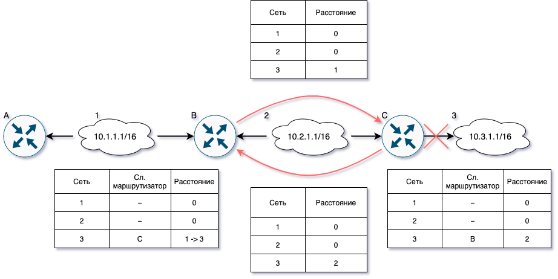

Предположим, что вышел из стоя канал между маршрутизатором C и сетью 3. Маршрутизатор обнаружит эту проблему и удалить
из своей таблицы маршрут до 3. При этом маршрутизатор B в это время может прислать анонс маршрута до 3 с длиной 1 (т.е.
через маршрутизатор C, но C об этом не знает). Маршрутизатор C запишет в свою таблицу маршрут через B с длиной 1 и
отправит анонс на B. B увидит, что маршрут через C изменился с 1 на 2 и перезапишет в своей таблице маршрут через C с 1
на 2. И отправит это обратно на C. C в свою очередь перезапишет маршрут через B с 1 на 3 и так далее. В итоге маршрут
будет удален только в тот момент, когда счет достигнет 16. При этом пакеты будут ходить туда B и C.

Для предотвращения такого поведения в IP есть время жизни пакета, так же:

* Split horizon – не отправлять информацию о сети на тот интерфейс, откуда пришел запрос;
* Route poisoning – при обнаружении недоступности, сообщить о его недоступности, отправив расстояние 16;
* HoldDown – таймер на изменение записей о недоступности маршрута, т.е. какое-то время мы игнорируем анонсы о новом
  маршруте к недоступной сети.

#### OSPF (Open Shortest Path First)

OSPF (протокол динамической маршрутизации), основанный на технологии отслеживания состояния канала (link-state
technology) и использующий для нахождения кратчайшего пути алгоритм Дейкстры.

Алгоритм:

1. Маршрутизаторы производят обмен малыми пакетами HELLO.
1. После выполнения обмена между ними устанавливаются соседства. Каждый из маршрутизаторов добавляет в специальную
   локальную таблицу соседей.
1. Маршрутизаторы выполняют сбор состояний своих связей с соседями (линков). Линки включают id самого маршрутизатора и
   соседа, сеть и префикс, тип сети и метрику (стоимость линка). После сбора состояний маршрутизатор формирует пакет
   LSA (Link State Advertisement).
1. LSA рассылается каждому соседу, который передает пакет дальше по сети.
1. После получения пакета LSA каждый маршрутизатор добавляет содержащуюся в нем информацию в локальную таблицу LSDB (
   Link State Database).
1. В таблице LSDB накапливаются данные обо всех парах маршрутизаторов в пределах сети.
1. На основании накопленных данных выстраивается полная карта сети, которая включает все действующие маршрутизаторы и
   образованные между ними связи. Каждой связи признается свой вес. За вес принимается пропускная способность и,
   возможно, особенности сети (канал быстрый, но передача больших объемов данных по нему дорогая).
1. Используя карту, каждый маршрутизатор выполняет поиск самых коротких маршрутов во все сети и формирует из них таблицу
   маршрутизации.
1. После построения маршрутов каждый маршрутизатор раз в 10 секунд рассылает сообщение HELLO для того, чтобы проверить
   их доступность и работоспособность. В ответ маршрутизатор тоже ожидает получить HELLO, и, если, в течении 40 секунд
   ответ не пришел, то маршрутизатор считается недоступным, и в сети рассылается информация о его недоступности. После
   этого снова производится перерасчет стоимости маршрутов в сети и формируется новые таблицы маршрутизации.

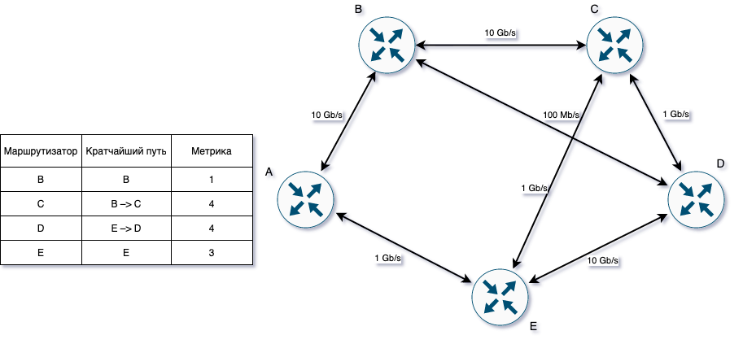

Если каждый маршрутизатор будет собирать полную информацию о сети, то это займет много времени и потребует большого
количества траффика в сети. Поэтому в OSPF есть такое понятие как Designated router (DR, выделенный маршрутизатор) –
управляет процессом рассылки информации о состоянии канала в сети. Каждый маршрутизатор сети устанавливает отношения
соседства с DR. Информация об изменениях в сети отправляется DR на отдельный интерфейс, доступный только ему, DR
получает эту информацию и отправляет ее остальным маршрутизаторам сети. При выходе его из строя должен быть выбран новый
DR. Новые отношения соседства должны быть сформированы и, пока базы данных маршрутизаторов не синхронизируются с базой
данных нового DR, сеть будет недоступна для пересылки пакетов. Для устранения этого недостатка выбирается Backup
designated router (BDR, резервный выделенный маршрутизатор). Каждый маршрутизатор сети устанавливает отношения соседства
не только с DR, но и BDR. DR и BDR также устанавливают отношения соседства и между собой. При выходе из строя DR, BDR
становится DR и выполняет все его функции. Так как маршрутизаторы сети установили отношения соседства с BDR, то время
недоступности сети минимизируется.

| Скорость соединения | Cost |
|---------------------|------|
| 10 Mb/s             | 31   |
| 100 Mb/s            | 10   |
| 1 Gb/s              | 3    |
| 10 Gb/s             | 1    |

#### Типы маршрутизаторов OSPF

Принцип действия протокола OSPF предусматривает использование следующих типов маршрутизаторов:

* IR (Internal Router) — это внутренний маршрутизатор, у которого все интерфейсы ассоциированы только с одной
  определенной областью.
* ABR (Area Border Router) — устанавливается в нулевой зоне для обеспечения связи с другими зонами.
* ASBR (Autonomous System Boundary Router) — обеспечивает объединение автономных систем для обмена маршрутами.

#### Таблица маршрутизации

Таблица маршрутизации роутера выглядит следующим образом:

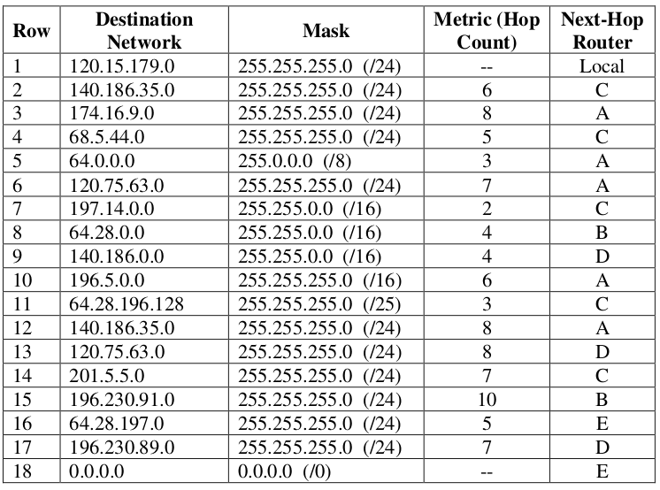

Если информации о достижимости нет в таблице, то пакет просто отбрасывается. IP состоит из адреса, маски подсети и
адреса шлюза. Шлюз используется, если запрашиваемый адрес находится вне подсети.

При передаче данных между сетями MAC-адрес устанавливается в MAC-адрес маршрутизатора, а dest IP в реальный адрес
получателя.

#### BGP (Border Gateway Protocol)

OSPF прекрасно работает в любой сети, однако, если сеть большая, то необходимо разделить ее на зоны.

Представим сеть, состоящую из 100 и более маршрутизаторов. Каждый маршрутизатор должен хранить в базе данных полную
информацию о подключенных маршрутизаторах и интерфейсах всей сети. Кроме того, алгоритм SPF требует значительных
ресурсов памяти и процессора. Чтобы уменьшить нагрузку на сеть и маршрутизаторы протоколом OSPF предусмотрено разделение
сети на зоны. Маршрутизаторы одной зоны не знают топологию сети другой зоны, то есть не получают обновления с другой
зоны и таким образом уменьшается нагрузка на маршрутизатор.

В OSPF зона 0 (Area 0) всегда является магистральной (backbone), к которой подключаются остальные зоны. Связь между
зонами всегда осуществляется только через магистральную зону. Существует несколько видов зон:

* Backbone (магистральная) – отвечает за межзональную маршрутизацию. Все остальные зоны соединены с ней, и межзональная
  маршрутизация происходит через маршрутизатор соединенный с магистральной зоной.
* Standard (обычная) – может содержать пограничные маршрутизаторы зоны ABR (Area Border Router (пограничный
  маршрутизатор) – включается на стыке 2-х и более зон) и пограничные маршрутизаторы автономной системы ASBR (AS
  Boundary router - подключается на стыке разных автономных систем), то есть может подключаться к другим автономным
  системам.
* Stub (тупиковая) – не принимает анонсы о внешних сетях всей автономной зоны, однако принимает анонсы о других зонах.
  Маршрут к внешним сетям заменен на маршрут по умолчанию. Не может иметь ASBR маршрутизатор, то есть не подключается к
  другим автономным сетям.

Автономная система (autonomous system) — это совокупность сетей под единым административным управлением, обеспечивающим
общую для всех входящих в автономную систему маршрутизаторов политику маршрутизации. Обычно автономной системой
управляет один поставщик услуг Интернет. Автономная система использует внутренние шлюзовые протоколы IGP (RIP, OSPF и
т.п.).

BGP (протокол граничного шлюза) – единый протокол динамической маршрутизации между автономными системами. В обычной
ситуации, когда вы подключаетесь к провайдеру, он выдаёт вам диапазон публичных адресов – так называемые PA-адреса (
Provider Aggregatable). Получить их – раз плюнуть, но если вы не являетесь LIR’ом, то при смене провайдера придётся
возвращать и PA-адреса. Тем более фактически допускается подключение только к одному провайдеру. И если вы решите
сменить провайдера, то старые адреса уйдут вместе с ним, а новый провайдер выдаст новые. У LIR вы можете приобрести
повайдеро-независимый блок адресов (PI) и обязательно ASN. В нашем случае пусть это будет блок 100.0.0.0/23, который мы
будем анонсировать по BGP своим соседям. И эти адреса уже чисто наши и никакие провайдеры нам не страшны: не понравился
один – ушли к другому с сохранением своих адресов.

Задача протокола BGP – вычисление маршрута между целыми автономными системами. Протокол для построения маршрутов
использует дистанционно-векторный протокол, при этом маршрутизаторы обмениваются с соседями информацией о доступным им
автономных системах. В информации о маршруте передаются три части:

* информация об автономной системе (один или несколько префиксов сетей);
* вектор пути – список промежуточных автономных систем;
* следующий маршрутизатор (указывается потому что для доступа между автономными системами может использоваться больше
  одного маршрутизатора).

Для надежности передачи данных используется протокол TCP (порт 179).

В BGP не возникает петель, т.к. В сообщение содержится путь через автономные системы.

## Протокол TCP

TCP (протокол управления передачей) — механизм TCP предоставляет поток данных с предварительной установкой соединения,
осуществляет повторный запрос данных в случае потери данных и устраняет дублирование при получении двух копий одного
пакета, гарантируя тем самым, целостность передаваемых данных и уведомление отправителя о результатах передачи. Единицей
передачи данных является сегмент. В сетях существует:

* потеря пакетов;
* перестановка пакетов местами (редкое явление, но случается в беспроводных сетях);
* когда пакеты отправляются равномерно, а приходят очередями с задержкой примерно в 50 мс.

Все эти особенности передачи данных успешно устраняет TCP.

### Гарантия доставки

Для гарантии доставки данных TCP использует подтверждение получения сообщения. Если подтверждение не получено, то
отправитель через некоторые время повторяет отправку. Для гарантии правильной последовательности доставки каждому
сообщению присватается свой номер последовательности (Sequence Number) – он определяет номер первого байта. Номера
считаются не с нуля – при установке выбирается Sequence Number, – он используется как стартовое смещение. С помощью
номера подтверждения получатель указывает, какая часть передаваемой последовательности успешно до него дошла. В этом
поле указывается номер первого байта после непрерывной области принятых данных. Подтверждение, таким образом,
высылается не на сегмент, а на все полученные байты с начала потока и до указанной позиции.

В среде передачи данных сообщения передаются не мгновенно, поэтому в среде передачи данных может находится некоторый
объем данных (скорость * задержка). Поэтому ожидание повреждения на каждое сообщение приводит к снижению
производительности. Для это используется скользящее окно (Sliding Window) – количество байтов данных, которые могут быть
переданы без получения подтверждения. Если мы заполнили окно, то ждем подтверждения получения данных. Как только мы
получили подтверждение, мы сдвигаем окно и передаем новую порцию данных.

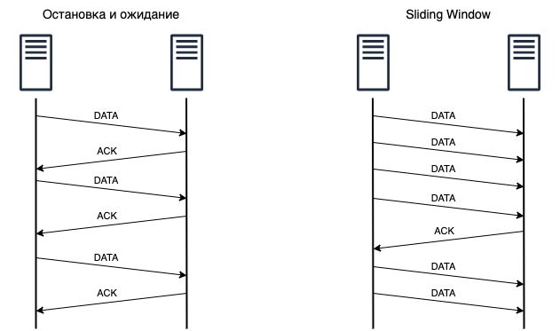

Существует два вида подтверждения:

* Cumulative ack – используется по-умолчанию, подтверждает прием N байт от начала сообщения.
* Selective ack – подтверждается прием диапазона байт.

### Установка соединения

Процесс начала сеанса TCP (handshake), состоит из трёх шагов:

* Клиент отправляет на сервер сообщение SYN с номером последовательности.
* Сервер отправляет в ответ SYN с другим номером последовательности и ACK с номером последовательности, пришедшим от
  пользователя, + 1 и переходит в состояние SYN-RECEIVED.
* Если клиент получает сегмент с флагом RST, то он прекращает попытки соединиться.
* Если клиент не получает ответа в течение 10 секунд, то он повторяет процесс соединения заново.
* Если клиент получил SYN, то он переходит в состояние ESTABLISHED и отправляет серверу его номер + 1.
* Если сервер в состоянии SYN-RECEIVED получает сегмент с флагом ACK, то он переходит в состояние ESTABLISHED.

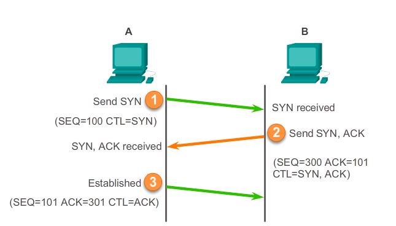

Существуют экспериментальные расширения протокола TCP, сокращающие количество пакетов при установлении соединения,
например TCP Fast Open (TFO). Это расширение использует TCP-cookie (TCP option), которые являются зашифрованными данными
о соединении, хранящимися на клиенте, и устанавливающимися при первичной установке TCP-соединения. При работе TFO клиент
отправляет эти cookie на сервер вместе с SYN-пакетом, и, если сервер успешно аутентифицировал пользователя, он может
сразу начать передавать данные.

### Закрытие соединения

Поскольку TCP-соединение является дуплексным, любая из сторон может закрыть соединение. Для этого она отправляет
сообщение FYN, а другая сторона отправляет ACK. При этом соединение переходит в состояние Half-Closed и вторая сторона
может передавать сообщение. Чтобы полностью закрыть соединения нужно вызвать FYN с каждой стороны. Для экстренного
прерывания соединения используется флаг RST.

### Flow Control

TCP использует Flow Control (управление потоком) для предотвращения отправителем отправки слишком большого количества
данных, которое не сможет обработать получатель. Для этого используется поле размер окна в заголовке TCP. Приложение
имеет некоторый буфер, куда записываются входящие сегменты данных. Отправитель отправляет данные, получатель записывает
эти данные в буфер и отправляет вместе с подтверждением информацию сколько свободного места осталось (кратному
сегментам) – это размер окна получения. Если отправитель исчерпал размер окна, то он ждет от получателя подтверждения
нового размера окна. Если получатель ответил нулевым размером окна, то отправитель через какое-то время пытается
отправить сообщение (zero window probe), чтобы получить информацию о новом размере окна.

### Congestion control

Т.к. интернет является гетерогенной системой, при передаче сообщения оно проходит через большое количество сетевых
устройств. Размер передаваемого сообщения определяется не только размером буфера получателя, но так же и загруженностью
сети. Может возникнуть ситуация, при которой возникает перегрузка какого-либо маршрутизатора в сети. Маршрутизатор не
справляется и начинает отбрасывать пакеты, из-за этого снижается пропускная способность сети. Чтобы предотвратить эту
ситуацию, используется управление перегрузкой (Congestion Control) – динамическое изменение размера окна отправителя.
Если размер окна маленький – сегментов отправляется мало, не полностью используется пропускная способность сети. Если
большой – возникает большая нагрузка и маршрутизаторы отбрасывают пакеты, из-за этого тоже снижается скорость передачи
сообщений, потому что TCP требуется выполнять повторную отправку. Для определения перегрузки используется комбинация из
двух методов:

* Считается, что каналы передачи данных надежные и если начали теряться сообщения – то случилась перегрузка сети и их
  отбрасывает какой-то маршрутизатор.
* Если скорость RTT стала меньше, то значит где-то случилась перегрузка и маршрутизатор не справляется и надо тоже
  уменьшать размер окна передачи. Но этим методом пользуются не все и получается что какой-то отправитель уменьшает
  размер окна, тем самым снижая нагрузку на сети, а остальные отправители готовы уменьшать размер окна только когда
  начнут теряться пакеты.

Explicit congestion notification – маршрутизатор находится в состоянии близком к перегрузке, он устанавливает флаг,
свидетельствующий о перегрузке, в сообщении IP. Сообщение доходит до получателя, при отправке подтверждения он
устанавливает флаги перегрузки в TCP сообщении.

#### Аддитивное увеличение, мультипликативное уменьшение

При получении каждого подтверждения мы прибавляем к размеру окна некоторое значение, обычно это MSS, а при появлении
перегрузки уменьшаем размер окна в два раза.

#### Медленный старт

Первоначально размер окна устанавливается маленьким, при каждом подтверждении размер окна увеличивается на 2, происходит
экспоненциальный рост размера окна. После сигнала о перегрузке размер окна снова становится минимальным.

#### Комбинированный вариант

На практике в TCP используется комбинация методов аддитивного увеличения, мультипликативного уменьшения и медленного
страта. Для того чтобы быстро заполнить пропускную способность используется медленный старт, после того, как случилась
первая перегрузка размер окна уменьшается вдвое – порог медленного старта, и после этого уже используется метод
аддитивного увеличения, мультипликативного уменьшения.


### Maximum Segment Size (MSS)

MTU (maximum transmission unit) – максимальный размер полезного блока данных одного пакета, который может быть передан
протоколом без фрагментации. Термин Path MTU означает наименьший MTU на пути следования пакета в сети. Хотя фрагментация
решает проблему несоответствия размеров пакетов и значения MTU, она ощутимо снижает производительность сетевых
устройств. В связи с этим, в 1988 году была предложена альтернативная технология, названная Path MTU discovery (RFC
1191). Суть технологии заключается в том, что при соединении двух хостов устанавливается параметр DF (don’t fragment),
который запрещает фрагментацию пакетов. Это приводит к тому, что узел, значение MTU которого меньше размера пакета,
отклоняет передачу пакета и отправляет сообщение ICMP "необходима фрагментация, но установлен флаг её запрета (DF)".
Хост-отправитель уменьшает размер пакета и отсылает его заново. Такая операция происходит до тех пор, пока пакет не
будет достаточно мал, чтобы дойти до хоста-получателя без фрагментации.

В сети Ethernet MTU равен 1500 байт без учета Ethernet-заголовка.


MSS является параметром протокола TCP и определяет максимальный размер полезного блока данных в байтах для TCP-пакета (
сегмента). Таким образом этот параметр не учитывает длину заголовков TCP и IP. Для установления корректной TCP-сессии с
удалённым хостом должно соблюдаться следующее условие: `MSS + заголовок TCP + заголовок IP ≤ MTU`.

## Domain Name System (DNS)

DNS (система доменных имен) – компьютерная распределённая система для получения информации о доменах. Чаще всего
используется для получения IP-адреса по имени хоста, получения информации о маршрутизации почты, обслуживающих узлах для
протоколов в домене (SRV-запись).

Основой DNS является представление об иерархической структуре доменного имени и зонах. Каждый сервер, отвечающий за имя,
может делегировать ответственность за дальнейшую часть домена другому серверу (с административной точки зрения — другой
организации или человеку), что позволяет возложить ответственность за актуальность информации на серверы различных
организаций (людей), отвечающих только за "свою" часть доменного имени.

* Domain — узел в дереве имён, вместе со всеми подчинёнными ему узлами, то есть именованная ветвь или поддерево в дереве
  имён. Структура доменного имени отражает порядок следования узлов в иерархии; доменное имя читается слева направо от
  младших доменов к доменам высшего уровня (в порядке повышения значимости): вверху находится корневой домен (имеющий
  идентификатор "."), ниже идут домены первого уровня (доменные зоны), затем — домены второго уровня, третьего и т. д. (
  например, для адреса `ru.wikipedia.org`. домен первого уровня – `org`, второго – `wikipedia`, третьего – `ru`). DNS
  позволяет не указывать точку корневого домена.
* Subdomain – подчинённый домен (например, `wikipedia.org` – поддомен домена `org`, а `ru.wikipedia.org` –
  домена `wikipedia.org`).
* Зона – часть дерева доменных имён (включая ресурсные записи), размещаемая как единое целое на некотором DNS-сервере.
  Целью выделения части дерева в отдельную зону является передача ответственности за соответствующий домен другому лицу
  или организации. Это называется делегированием. Как связная часть дерева, зона внутри тоже представляет собой дерево.
* Делегирование — операция передачи ответственности за часть дерева доменных имён другому лицу или организации. За счёт
  делегирования в DNS обеспечивается распределённость администрирования и хранения. Технически делегирование выражается
  в выделении этой части дерева в отдельную зону, и размещении этой зоны на DNS-сервере, управляемом этим лицом или
  организацией. При этом в родительскую зону включаются "склеивающие" ресурсные записи (NS и А), содержащие указатели на
  DNS-сервера дочерней зоны, а вся остальная информация, относящаяся к дочерней зоне, хранится уже на DNS-серверах
  дочерней зоны.
* Авторитетность – признак размещения зоны на DNS-сервере. Ответы DNS-сервера могут быть двух типов:
  авторитетные (когда сервер заявляет, что сам отвечает за зону) и неавторитетные, когда сервер обрабатывает запрос, и
  возвращает ответ других серверов. В некоторых случаях вместо передачи запроса дальше DNS-сервер может вернуть уже
  известное ему (по запросам ранее) значение (режим кеширования).

DNS используется в первую очередь для преобразования символьных имён в IP-адреса, но он также может выполнять обратный
процесс. Существует специальный домен `in-addr.arpa`, записи в котором используются для преобразования IP-адресов в
символьные имена.

```shell
dig ya.ru -t A
ya.ru.			580	IN	A	87.250.250.242

dig -x 87.250.250.242
242.250.250.87.in-addr.arpa. 298 IN	PTR	ya.ru.
```

Типы DNS записей:

* A (Address Record) – связывает имя хоста с адресом протокола IPv4.
* AAAA (IPv6 Address Record) – связывает имя хоста с адресом протокола IPv6.
* CNAME (Canonical Name Record) – псевдоним, используется для перенаправления на другое имя.
* MX (Mail Exchange) – указывает сервера) обмена почтой для данного домена.
* NS (Name Server) – указывает на DNS-сервер для данного домена.
* PTR (Pointer) – обратная DNS-запись или запись указателя связывает IP-адрес хоста с его каноническим именем.
* SOA (Start of Authority) – начальная запись зоны указывает, на каком сервере хранится эталонная информация о данном
  домене, содержит контактную информацию лица, ответственного за данную зону, тайминги (параметры времени) кеширования
  зонной информации и взаимодействия DNS-серверов.

## Отказоустойчивость на сетевом уровне

### Round Robin DNS

В случае падения мы можем сигнализировать провайдеру, чтобы он убрал ip из DNS, но кэши обновляются не сразу. Надо иметь
возможность быстро ввести новый сервер на место упавшего. Amazon ELB работает по этому принципу.

### Geo DNS (CDN)

DNS сервера также позволяют отдавать разные IP адреса для клиентов на основе их местоположения. DNS сервер отдает адрес
корневого сервера в том регионе, откуда пришел клиент и весь резолвинг происходит в одном регионе.

### Global Server Load Balancing (GSLB)

GSLB используется для отказоустойчивости и балансировки нагрузки между data-центрами. В основе лежит DNS протокол.
Предположим, за обслуживание наших data-центров отвечает a10networks.com. Их DNS-сервера умеют самостоятельно проверять
работоспособность дата-центров, и в случае если health-check не прошел, то они временно убираются из DNS. Если не прошли
все проверки по всем data-центрам, значит что-то случилось с самими health-check, и отдаются все адреса.

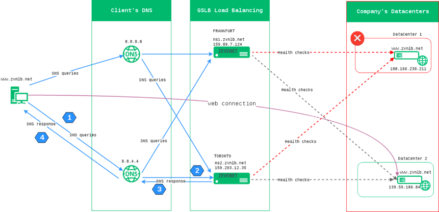

### BGP anycast

Через BGP мы можем анонсировать свою подсеть из разных регионов. Т.е. Для Москвы и Владивостока мы анонсируем
`111.22.23.8/24` и клиент из Владивостока пойдет на сервера, располагающиеся ближе к нему, т.к. При построении маршрута
граничный маршрутизатор скажет ему, что есть ближайший маршрут до нужного ip-адреса. Если что-то сломалось, то мы
анонсируем изменения, маршруты быстро перестраиваются и запросы идут по другому пути.

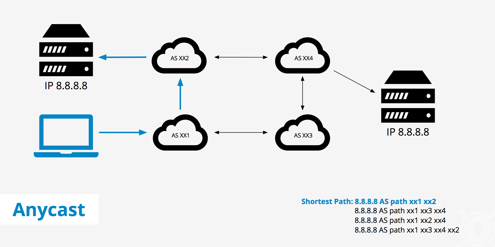

### Multihomed BGP

К конечной АС подключаются два провайдера, оба анонсируют сеть, трафик идет через одного (настраивается на уровне
граничных маршрутизаторов), второй выступает резервным. В случае падения первого провайдера, BGP анонсирует изменения, и
трафик пойдет через второго.

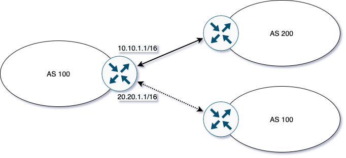

## Литература

1. [Как работают сети: что такое свитч, роутер, DNS, DHCP, NAT, VPN и ещё с десяток необходимых вещей](https://mkdev.me/posts/kak-rabotayut-seti-chto-takoe-svitch-router-dns-dhcp-nat-vpn-i-eschyo-s-desyatok-neobhodimyh-veschey)
1. [Сети для самых маленьких. Часть шестая. Динамическая маршрутизация](https://linkmeup.ru/blog/1195/)
1. [Сети для самых маленьких. Часть восьмая. BGP и IP SLA](https://linkmeup.ru/blog/1198/)
1. [Компьютерные сети. Продвинутые темы](https://www.youtube.com/playlist?list=PLtPJ9lKvJ4oh_w4_jtRnKE11aqeRldCFI)
1. [Компьютерные сети, учебный курс](https://www.youtube.com/playlist?list=PLtPJ9lKvJ4oiNMvYbOzCmWy6cRzYAh9B1)
1. [Протокол маршрутизации OSPF](https://www.smart-soft.ru/blog/protokol_marshrutizatsii_ospf/)
1. [TCP против UDP или будущее сетевых протоколов](https://habr.com/ru/company/oleg-bunin/blog/461829/)
1. Внутренние механизмы ТСР, влияющие на скорость загрузки. [Часть 1](https://habr.com/ru/company/webo/blog/326258/),
   [Часть 2](https://habr.com/ru/company/webo/blog/327050/)
1. [Building Blocks of TCP](https://hpbn.co/building-blocks-of-tcp/)
1. [What is BGP? | BGP routing explained](https://www.cloudflare.com/learning/security/glossary/what-is-bgp/)
1. [Давайте уже разберемся в DNS](https://habr.com/ru/post/303446/)
1. [Отказоустойчивость сервисов и интернет](https://www.youtube.com/watch?v=kY4lYiqxf7k)
